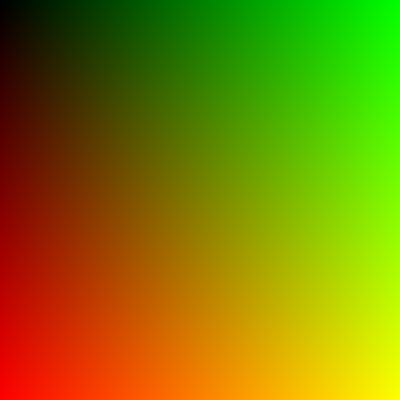
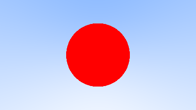
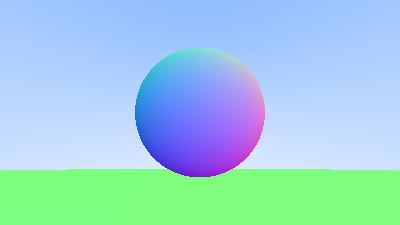

# ray_tracing

This repository is my Lean 4 implementation following along with [Ray Tracing in One Weekend](https://raytracing.github.io/books/RayTracingInOneWeekend.html).

Each image in the book can be generated by running the corresponding `#eval` command in `Example.lean`.

## Output Comparison

| Render | Expected | Actual |
| :--- | :---: | :---: |
| First PPM Image |  |  |
| Blue to White Gradient |  |  |
| Red Sphere |  |  |
| Surface Normals Sphere |  |  |
| Sphere with Ground |  |  |